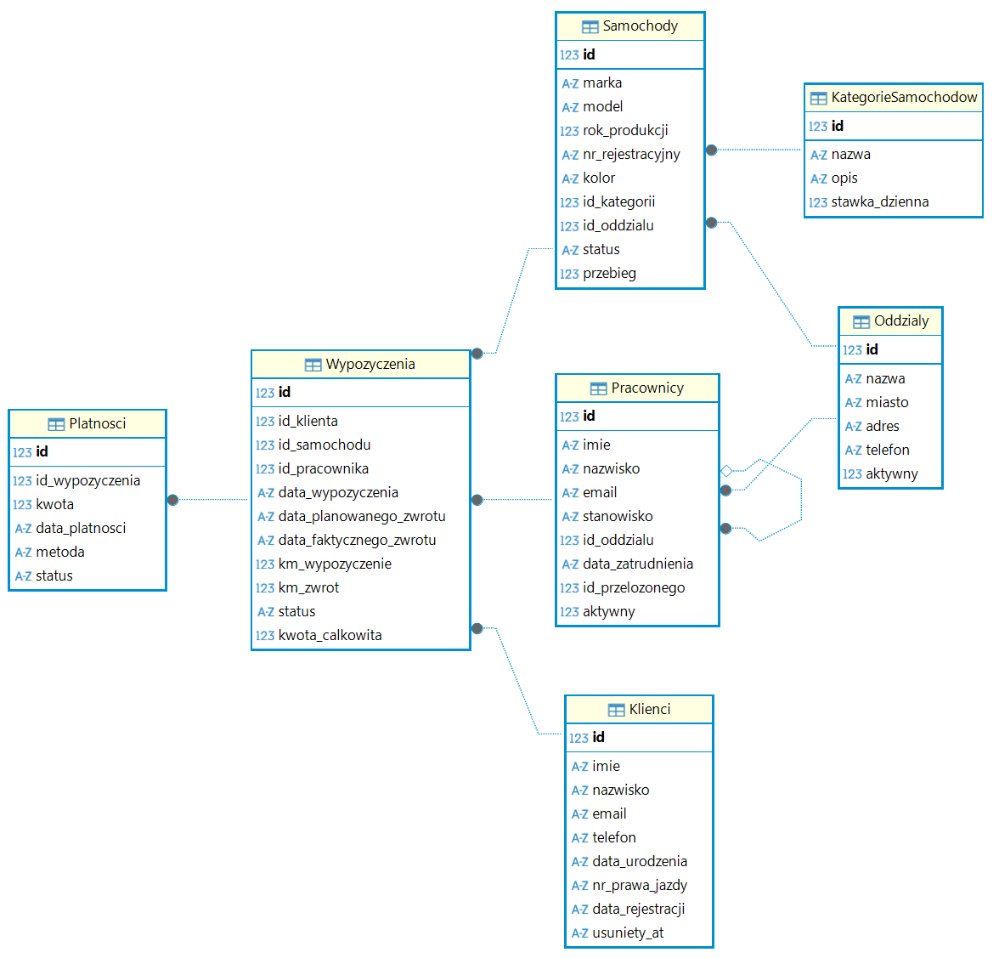

# dev_horizon labs: Text-to-SQL

Na tym warsztacie zbudujesz asystenta, który odpowiada na pytania po polsku, odpytując bazę danych wypożyczalni samochodów. Nauczysz się dwóch kluczowych technik pracy z modelami językowymi: Function Calling i Structured Output.

---

## Środowisko

Pracujesz w **GitHub Codespaces** — środowisko jest gotowe. Python, baza danych i wszystkie biblioteki są już zainstalowane. Nic nie konfigurujesz.

### Model językowy i klucz API

Model językowy (LLM) to zewnętrzna usługa — tak jak strona internetowa, do której wysyłasz zapytania. Żeby korzystać z tej usługi, potrzebny jest **klucz API** — coś w rodzaju hasła identyfikującego, że masz prawo wysyłać zapytania.

W tym warsztacie używamy **OpenAI API**. Klucz jest już skonfigurowany — kod ładuje go automatycznie. Nie musisz nic robić.

W kodzie zobaczysz wywołanie modelu, na przykład:
```python
response = client.chat.completions.create(
    model=MODELS.gpt_4o_mini,
    messages=messages,
    tools=[GET_CAR_COUNT_TOOL],
)
```
Gdzie:
- `client` to klient OpenAI, który łączy się z API OpenAI
- `MODELS.gpt_4o_mini` to model językowy
- `messages` to wiadomości wysłane do modelu
- `tools` to lista narzędzi, które model może wywołać
- `GET_CAR_COUNT_TOOL` to przykładowe używane narzędzie, które zwraca liczbę samochodów
- `response` to odpowiedź modelu

### Przeglądanie bazy danych

W panelu po lewej stronie edytora masz zainstalowane rozszerzenie **SQLite Viewer**.
Kliknij na plik `data/wypozyczalnia.db` — zobaczysz tabele i dane w czytelnej formie.



---

## Baza danych

Baza to wypożyczalnia samochodów z oddziałami w Płocku, Warszawie, Łodzi i Gdańsku.

| Tabela | Zawartość |
|--------|-----------|
| `Oddzialy` | 6 oddziałów |
| `KategorieSamochodow` | 6 kategorii (Ekonomiczny, Kompaktowy, SUV, Premium, Dostawczy, Elektryczny) |
| `Samochody` | 80 samochodów |
| `Klienci` | 120 klientów |
| `Pracownicy` | 30 pracowników |
| `Wypozyczenia` | 300 wypożyczeń |
| `Platnosci` | Płatności powiązane z wypożyczeniami - 195 rekordów |

---

## Krok 0: Sprawdź połączenie z modelem

```bash
python cp0.py
```

Powinieneś zobaczyć: `pong` (lub podobną odpowiedź modelu).
Jeśli działa — przejdź do CP1.

---

## CP1: Function Calling (`cp1good.py`)

Model odpytuje bazę danych narzędziem zamiast zgadywać z danych w prompcie.

### Krok 1 — obejrzyj antywzorzec

[Otwórz `cp1bad.py`](./cp1bad.py)

Sprawdź, jak działa antywzorzec Prompt Stuffing, czyli wrzucanie wszystkich danych z bazy do promptu. Uruchom w terminalu komendę:
```bash
python cp1bad.py
```

Zobaczysz wszystkie dane z bazy wrzucone do promptu i liczbę użytych tokenów. To nieefektywne — co jeśli baza ma 100× więcej danych?

### Krok 2 — poprawne podejście - Function Calling. Przeczytaj mini przykład.

[Otwórz `cp1good.py`](./cp1good.py) i przeczytaj **Sekcję 1** (MINI PRZYKŁAD). To najprostsze możliwe Function Calling: narzędzie bez parametrów, które zwraca liczbę samochodów. Przeczytaj kod. Uruchom w terminalu komendę:
```bash
python cp1good.py
```
Zrozum jak działa podejście: pytanie → narzędzie → wynik → odpowiedź.

### Krok 3 — Twoje zadanie

W [`cp1good.py`](./cp1good.py) odkomentuj **dwa oznaczone bloki** w Sekcji 2:
1. Definicję parametru `sql_query` w `EXECUTE_SQL_TOOL`
2. Logikę walidacji SQL w funkcji `ask()`

Następnie odkomentuj blok uruchamiający Sekcję 2 na dole pliku i uruchom:

```bash
python cp1good.py
```

Powinieneś zobaczyć odpowiedzi na 4 pytania i liczbę tokenów przy każdym.

---

## CP2: Structured Output (`cp2good.py`)

Model zwraca ustrukturyzowany raport jako obiekt Pythona zamiast tekstu do ręcznego parsowania.

### Krok 1 — obejrzyj antywzorce

[Otwórz `cp2bad1.py`](./cp2bad1.py)

Sprawdź, jak działa antywzorzec **Luźna instrukcja JSON**, czyli model dostaje luźną instrukcję "sformatuj jako JSON" — bez podanej oczekiwanej struktury. Uruchom w terminalu komendę:

```bash
python cp2bad1.py
```

Zobaczysz 5 odpowiedzi z modelu i porównanie struktur JSON w odpowiedziach.

[Otwórz `cp2bad2.py`](./cp2bad2.py)

Sprawdź, jak działa antywzorzec **Sprzeczne instrukcje**, czyli model ma wyjaśnić wnioski i jednocześnie zwrócić czysty JSON. Uruchom w terminalu komendę:

```bash
python cp2bad2.py
```

Zobaczysz 5 odpowiedzi z modelu i porównanie struktur JSON w odpowiedziach.

### Krok 2 — Poprawne podejście - Structured Output. Przeczytaj mini przykład.

[Otwórz `cp2good.py`](./cp2good.py) i przeczytaj **Sekcję 1** (MINI PRZYKŁAD). Jeden model Pydantic `TinyReport` z jednym polem `title`. Zwróć uwagę na `client.chat.completions.parse()` zamiast `.create()` — to wrapper, który automatycznie konwertuje odpowiedź na obiekt Pydantic. Przeczytaj kod. Uruchom w terminalu komendę:
```bash
python cp2good.py
```
Zobaczysz raport z tytułem, wartością główną, tabelą wierszy i podsumowaniem.

### Krok 3 — Twoje zadanie

W [`cp2good.py`](./cp2good.py) odkomentuj **trzy oznaczone bloki** w Sekcji 2:
1. Klasę `ReportRow`
2. Klasę `RentalReport`
3. Funkcję `full_report()`

Następnie odkomentuj blok uruchamiający Sekcję 2 na dole pliku i uruchom w terminalu komendę:

```bash
python cp2good.py
```

Powinieneś zobaczyć raport z tytułem, wartością główną, tabelą wierszy i podsumowaniem.

---

## CP3: Pipeline (`cp3good.py`)

Łączysz checkpointy CP1 i CP2 w jeden pipeline — model odpytuje bazę, formatuje raport, zapisuje do pliku markdown.

### Krok 1 — Sprawdź importy

[Otwórz `cp3good.py`](./cp3good.py) i przeczytaj **Sekcję 1**. Skrypt importuje `ask` z CP1 i `full_report` z CP2. Upewnij się że **oba** checkpointy mają odkomentowane sekcje zadań (CP1 Sekcja 2, CP2 Sekcja 2). 

### Krok 2 — Uruchom pipeline

Uruchom w terminalu komendę:

```bash
python cp3good.py
```

Pipeline przetworzy 5 pytań. Wygenerowany raport znajdziesz w katalogu `raporty/` — otwórz go w edytorze.

---

## Logi API

Po każdym uruchomieniu `cpX.py` powstaje plik `<nazwa_skryptu>.logs.txt` w głównym katalogu repozytorium (np. `cp1good.logs.txt`).

Otwórz go w edytorze — zobaczysz dokładnie co wysłałeś do modelu i co odpowiedział. Każdy wpis zawiera:
- datę i godzinę wywołania
- wiadomości wysłane do modelu (`[system]`, `[user]`, `[tool]`)
- odpowiedź modelu (tekst lub wywołanie narzędzia)

To przydatne do zrozumienia co się dzieje "pod spodem" — szczególnie przy zadaniach bonusowych.

---

## Dostępne modele LLM

Modele dostępne na warsztacie są zdefiniowane w `lib/common.py` (klasa `MODELS`):

| Nazwa w kodzie | Model OpenAI |
|----------------|--------------|
| `MODELS.gpt_4o_mini` | gpt-4o-mini |
| `MODELS.gpt_4_1_mini` | gpt-4.1-mini |
| `MODELS.gpt_4_1_nano` | gpt-4.1-nano |
| `MODELS.gpt_5_mini` | gpt-5-mini |
| `MODELS.gpt_5_nano` | gpt-5-nano |
| `MODELS.gpt_5_4_mini` | gpt-5.4-mini |
| `MODELS.gpt_5_4_nano` | gpt-5.4-nano |

Żeby zmienić model w dowolnym checkpoincie, zamień `MODELS.gpt_4o_mini` na inny w wywołaniu `client.chat.completions.create(...)`.

---

## Uruchomienie lokalne

Warsztat jest zaprojektowany pod **GitHub Codespaces** — to główne i zalecane środowisko. Jeśli chcesz uruchomić repozytorium lokalnie, potrzebujesz Pythona 3.12, zależności z `requirements.txt` oraz pliku `.env` w głównym katalogu repozytorium.

```bash
python -m venv .venv
source .venv/bin/activate        # Linux/macOS
# .venv\Scripts\Activate.ps1   # Windows (PowerShell)
pip install -r requirements.txt
```

### OpenAI API

Utwórz plik `.env`:

```
OPENAI_BASE_URL=https://api.openai.com/v1
OPENAI_API_KEY=sk-proj-xxx
```

Klucz API znajdziesz lub wygenerujesz na stronie: [Gdzie znaleźć klucz OpenAI API?](https://help.openai.com/en/articles/4936850-where-do-i-find-my-openai-api-key)

### Lokalny serwer Ollama

Jeśli masz zainstalowany [Ollama](https://ollama.com), możesz użyć go zamiast OpenAI API. Ollama udostępnia endpoint kompatybilny z OpenAI pod adresem `http://localhost:11434/v1`:

```
OPENAI_BASE_URL=http://localhost:11434/v1
OPENAI_API_KEY=ollama
```

> `OPENAI_API_KEY` jest wymagane przez SDK, ale Ollama je ignoruje — możesz wpisać dowolny niepusty ciąg znaków.

Przed uruchomieniem pobierz model lokalnie, np.:

```bash
ollama pull llama3.2
```

Pamiętaj, że nazwy modeli w Ollama różnią się od nazw OpenAI — zamiast `MODELS.gpt_4o_mini` użyj nazwy modelu zgodnej z tym, co pobrałeś, np. `"llama3.2"` lub `"qwen2.5:7b"`. W plikach checkpointów zmień odpowiednio argument `model=` w wywołaniu `client.chat.completions.create(...)`.

---